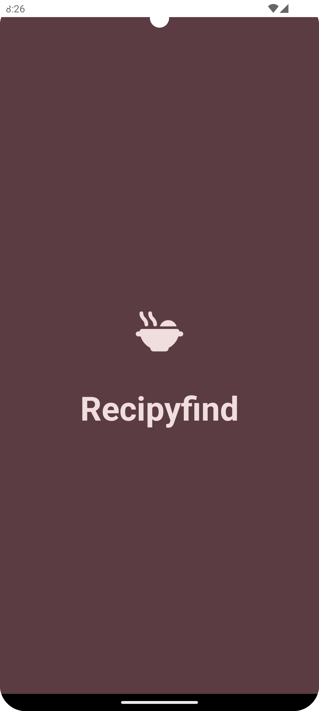
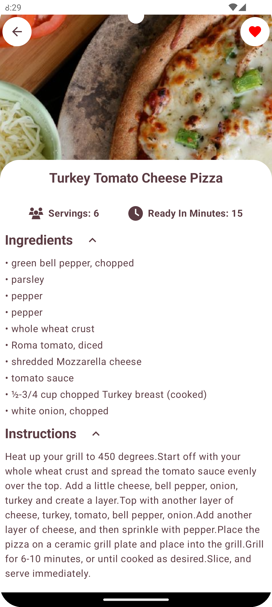
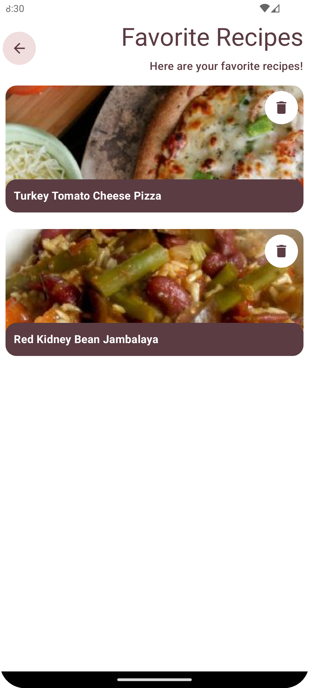

# Recipyfind

## Genel Bakış

"Recipyfind", yemek tariflerini keşfetmek ve kaydetmek için tasarlanmış bir Android uygulamasıdır. Kullanıcı dostu arayüzü ve zengin özellik seti ile yemek yapmayı seven herkes için ideal bir yardımcıdır. Modern Android geliştirme teknikleri kullanılarak Kotlin dilinde geliştirilmiştir.

## Kurulum

Projeyi yerelde çalıştırmak için aşağıdaki adımları izleyin:

1. GitHub üzerinden projeyi klonlayın veya zip dosyası olarak indirin.
2. Android Studio ile indirdiğiniz klasörü açın.
3. `local.properties` dosyasında `sdk.dir` anahtarını Android SDK'nızın yolu ile güncelleyin.
4. Android Studio'nun üst menüsünden `Build` -> `Make Project` seçeneğini seçerek projeyi derleyin.

## Özellikler

- **Tarif Arama ve Görüntüleme:** Kullanıcılar, çeşitli kategorilere göre tarif arayabilir ve detaylı tarif bilgilerini görüntüleyebilir.
- **Favori Tarifleri Kaydetme:** Beğenilen tarifler, daha sonra kolay erişim için favorilere eklenebilir.

## Teknik Detaylar

- **Mimari:** Clean Architecture kullanılarak geliştirilmiştir, bu sayede uygulamanın bakımı ve genişletilmesi kolaylaştırılmıştır.
- **Dependency Injection:** Dagger-Hilt kullanılarak uygulamanın çeşitli bileşenleri arasında bağımlılık çözümlemesi sağlanmıştır.
- **Asenkron İşlemler:** Coroutines ve Flow, ağ çağrıları ve veri işleme gibi asenkron işlemler için kullanılmıştır.
- **Veritabanı:** Room veritabanı, yerel veri depolama için kullanılmaktadır.
- **Navigation Component:** Android Jetpack Navigation component, uygulama içi gezinme için kullanılmaktadır.
- **Work Manager:** Periodic Worker kullanılarak uygulamaya belirli aralıklarla bildirim gönderilmesi sağlanmıştır.
- **Connectivity Service:** Proje manifestine bir Service tanımlanarak cihazın internet bağlantısını kontrol edip bağlantının sağlanma / sağlanmama durumlarına göre uygulama içi gezinimde değişiklikler sağlanmıştır.

## Ekran Görüntüleri

&nbsp;&nbsp;
&nbsp;&nbsp;
&nbsp;&nbsp;
&nbsp;&nbsp;
&nbsp;&nbsp;
